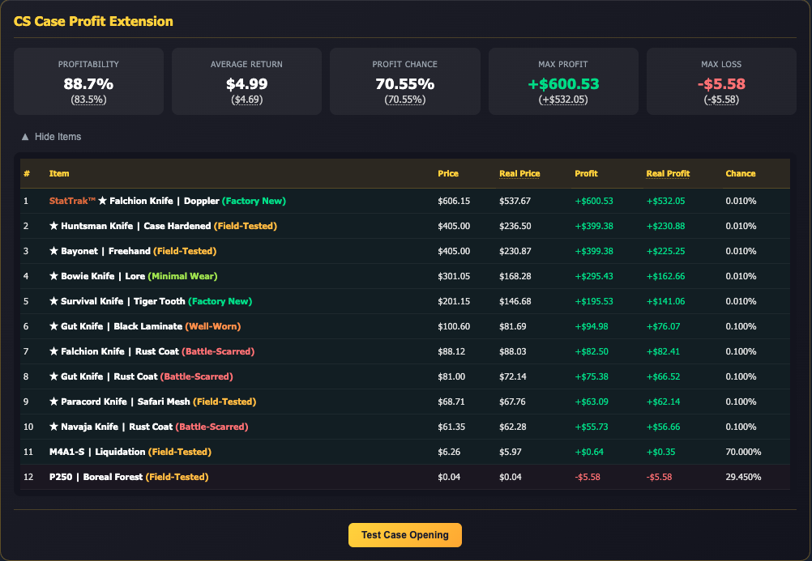

# CS Case Profit Extension

A browser extension that displays probability information, real skin market prices, and profit calculations for CS2 case opening websites.



## Features

- **Real-Time Profit Analysis**: See expected value (EV) and profit chance for any case before opening
- **Real Market Prices**: Fetches actual prices from Steam via CSGOTrader API
- **Test Opening**: Simulate case openings using real drop odds without spending money
- **Multi-Currency Support**: Displays prices in your preferred currency
- **Works Across 10+ Sites**: Unified experience across all major case opening platforms

## Supported Sites

- Hellcase
- KeyDrop
- DatDrop
- SkinClub
- CSGOEmpire
- CSGO500
- Clash.gg
- CSGO-Skins
- DaddySkins
- CSGOCases

## Installation

### From Source (Developer Mode)

1. Clone this repository:
   ```bash
   git clone https://github.com/yourusername/cscaseprofit.git
   ```

2. Open Chrome and navigate to `chrome://extensions/`

3. Enable "Developer mode" in the top right corner

4. Click "Load unpacked" and select the `extension` folder

5. The extension is now installed and active

### From Chrome Web Store

Coming soon...

## How It Works

When you visit a case page on any supported site, the extension:

1. **Detects the case** - Identifies which case you're viewing
2. **Fetches case data** - Gets item drop rates from the site's API
3. **Gets real prices** - Looks up skin market prices via CSGOTrader
4. **Calculates statistics** - Computes expected value, profit chance, and more
5. **Displays results** - Shows an info box with all the data

### Statistics Explained

- **Profitability**: Return percentage (EV / case price). Shows how much value you get back on average
- **Expected Value (EV)**: The average return you'd get per case opened over many trials
- **Profit Chance**: Percentage of outcomes where item value exceeds case cost
- **Max Profit**: The highest possible profit from the most expensive item
- **Max Loss**: The maximum you can lose (case price minus cheapest item)

### Color Coding

- **Green**: Profitable outcome (item value > case price)
- **Red**: Loss outcome (item value < case price)
- **Profitability color**: Red if below 86%, white if 86-90%, green if above 90%

## Architecture

### Site Adapters

Each supported site has its own adapter in `extension/src/sites/` containing:

- `parser.js` - Transforms site-specific data into unified format
- `api.js` - Handles API requests to the site
- `index.js` - Main adapter class implementing the site interface
- `promo.js` - (Optional) Manages banner

### Price Sources

- **Site Prices**: Displayed by the case opening site
- **Real Prices**: Fetched from [CSGOTrader](https://csgotrader.app/) (skin market data)

## Development

### Adding a New Site

1. Create a new folder in `extension/src/sites/yoursite/`

2. Implement the required files:
   - `parser.js` - Parse site data to unified format
   - `api.js` - Fetch case data from site
   - `index.js` - Adapter class with required methods

3. Add site to `extension/manifest.json`:
   - Add URL patterns to `host_permissions`
   - Add content script entry

4. Required adapter methods:
   ```javascript
   class YourSiteAdapter {
     isCasePage() { }           // Returns true if on a case page
     getInsertionPoint() { }    // Returns element to insert box after
     getCaseData() { }          // Returns case data in unified format
   }
   ```

5. (optional) If the site supports promo code while depositing, implement `promo.js` to manage the promo banner and code application (`CSCASEPROFIT`). I will be sharing revenue from deposits made using this code with the PR submitter!

### Testing

Load the extension in developer mode and visit any supported site's case page.

## Privacy

This extension:
- Does NOT collect any personal data
- Does NOT track your browsing
- Only communicates with CSGOTrader API for price data
- All data is stored locally in your browser

## Contributing

Contributions are welcome! Please feel free to submit a Pull Request.

## Disclaimer

This extension is for informational purposes only. Case opening involves real money and carries financial risk. Always gamble responsibly and only spend what you can afford to lose.

The extension is not affiliated with Valve, Steam, or any of the supported case opening sites.
